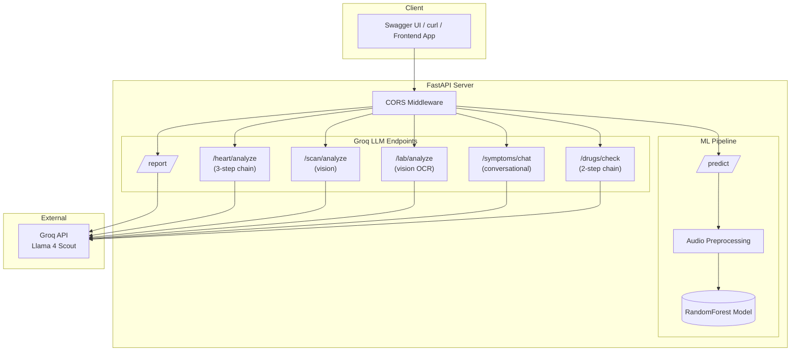
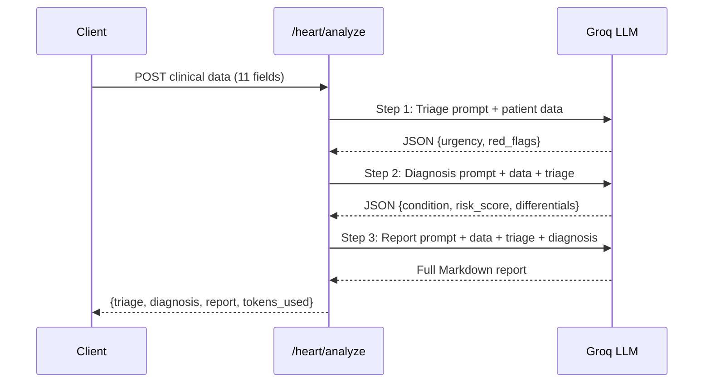
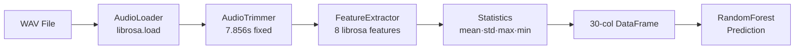

# 🏥 Medical AI Platform API

> **Respiratory Classifier** • **Heart Disease Analysis** • **Medical Imaging** • **Lab Reports** • **Symptom Checker** • **Drug Interactions**

A comprehensive medical AI REST API combining a pre-trained **Random Forest** classifier for respiratory diseases with **Amazon Bedrock (Claude 3.5 Sonnet)** powered endpoints for cardiac analysis, medical image interpretation, lab report reading, conversational symptom checking, and drug interaction analysis.

---

## Table of Contents

- [Features at a Glance](#-features-at-a-glance)
- [How the ML Model Was Built](#-how-the-ml-model-was-built)
- [API Endpoints](#-api-endpoints)
- [Project Structure](#-project-structure)
- [Quickstart](#-quickstart)
- [Docker](#-docker)
- [Architecture](#-architecture)
- [Environment Variables](#-environment-variables)

---

## ✨ Features at a Glance

| Domain | Endpoint | Input | AI Method |
|---|---|---|---|
| 🫁 Respiratory Prediction | `POST /predict` | 🎤 WAV audio | Random Forest ML |
| 📋 Patient Report | `POST /report` | 📝 JSON | Groq LLM |
| 🫀 Heart Disease | `POST /heart/analyze` | 📊 Clinical data | 3-step LLM chain |
| 🔬 Medical Imaging | `POST /scan/analyze` | 🖼️ Image | Vision LLM |
| 🧪 Lab Reports | `POST /lab/analyze` | 🖼️ Image | 2-step Vision LLM |
| 💬 Symptom Checker | `POST /symptoms/chat` | 💬 Chat | Conversational LLM |
| 💊 Drug Interactions | `POST /drugs/check` | 📝 JSON | 2-step LLM chain |
| ❤️ Health Check | `GET /` | — | — |
| 📋 Classes | `GET /classes` | — | — |

---

## 🧠 How the ML Model Was Built

### Dataset
- **Source:** [ICBHI Respiratory Sound Database](https://www.kaggle.com/datasets/vbookshelf/respiratory-sound-database) (Kaggle)
- **Content:** 920 annotated WAV recordings from 126 patients
- **Labels:** 8 respiratory conditions: Asthma, Bronchiectasis, Bronchiolitis, COPD, Healthy, LRTI, Pneumonia, URTI

### Feature Engineering

Each audio file trimmed to **7.856s** → 8 librosa features extracted → mean/std/max/min statistics → 30-column feature vector.

| Feature | Description |
|---|---|
| `chroma_stft` | 12 pitch class energy |
| `mfcc` (n=13) | Mel-frequency cepstral coefficients |
| `mel_spectrogram` | Energy in mel-frequency bands |
| `spectral_contrast` | Valley-to-peak ratio per sub-band |
| `spectral_centroid` | Centre of mass of the spectrum |
| `spectral_bandwidth` | Width of the spectrum |
| `spectral_rolloff` | Frequency below which 85% energy lies |
| `zero_crossing_rate` | Rate of sign changes in the signal |

### Model

```
RandomForestClassifier
  ├── Tuning: Optuna (30 Bayesian trials)
  ├── Validation: StratifiedKFold (5 folds)
  ├── Class imbalance: balanced class_weight
  └── Result: 91% weighted F1-score
```

---

## 🌐 API Endpoints

### `POST /predict` — Respiratory Audio Classification

Upload a WAV breath/cough recording → ML model returns prediction + confidence.

```bash
curl -X POST "http://localhost:8000/predict" -F "file=@cough.wav"
```

```json
{
  "prediction": "COPD",
  "confidence": 0.87,
  "all_probabilities": { "Asthma": 0.02, "COPD": 0.87, "Healthy": 0.05, ... }
}
```

---

### `POST /report` — AI Patient Report

Generate a comprehensive Markdown report for a diagnosed respiratory condition.

```bash
curl -X POST "http://localhost:8000/report" \
     -H "Content-Type: application/json" \
     -d '{"disease": "COPD", "age": 65, "height": 170, "weight": 82}'
```

---

### `POST /heart/analyze` — Heart Disease Risk Analysis

**3-step LLM chain:** Triage → Diagnosis → Report. All 11 clinical fields required.

```bash
curl -X POST "http://localhost:8000/heart/analyze" \
     -H "Content-Type: application/json" \
     -d '{
       "age": 55, "sex": "M", "chest_pain_type": "ASY",
       "resting_bp": 140, "cholesterol": 260, "fasting_bs": 1,
       "resting_ecg": "ST", "max_hr": 130, "exercise_angina": "Y",
       "oldpeak": 2.0, "st_slope": "Flat"
     }'
```

**Response:** `triage` (urgency + red flags) → `diagnosis` (conditions + risk score) → `report` (full Markdown)

---

### `POST /scan/analyze` — Medical Image Analysis

Upload a chest X-ray, ECG, CT scan, or MRI → Vision model returns findings + radiology report.

```bash
curl -X POST "http://localhost:8000/scan/analyze" \
     -F "file=@chest_xray.jpg" \
     -F "scan_type=chest_xray"
```

**Scan types:** `chest_xray` | `ecg` | `ct_scan` | `mri`

---

### `POST /lab/analyze` — Lab Report Analyzer

Upload a photo of a blood test → Vision model OCRs values → interprets with normal ranges.

```bash
curl -X POST "http://localhost:8000/lab/analyze" \
     -F "file=@blood_test.jpg" \
     -F "report_type=cbc"
```

**Report types:** `blood_test` | `cbc` | `lipid_panel` | `liver_function` | `kidney_function` | `thyroid_panel` | `metabolic_panel` | `urine_test` | `general`

---

### `POST /symptoms/chat` — Symptom Checker Chatbot

Stateless conversational AI — send full chat history, get structured response.

```bash
curl -X POST "http://localhost:8000/symptoms/chat" \
     -H "Content-Type: application/json" \
     -d '{"messages": [{"role": "user", "content": "I have a persistent cough and chest tightness"}]}'
```

**Response includes:** `reply`, `follow_up_questions`, `suspected_conditions`, `urgency`, `should_continue`

---

### `POST /drugs/check` — Drug Interaction Checker

Check medications for interactions, contraindications, and safety warnings.

```bash
curl -X POST "http://localhost:8000/drugs/check" \
     -H "Content-Type: application/json" \
     -d '{
       "medications": ["Metformin", "Lisinopril", "Aspirin"],
       "condition": "COPD",
       "age": 65,
       "allergies": ["Penicillin"]
     }'
```

**Response includes:** pairwise `interactions` (with severity), `warnings`, `safe_summary`, full `report`

---

## 📁 Project Structure

```
Medical_AI_Platform/
├── main.py                         # FastAPI entrypoint (middleware, routers)
├── model_utils.py                  # Audio preprocessing pipeline classes
├── respiratory_classifier.pkl      # Trained Random Forest model
├── .env                            # GROQ_API_KEY (not committed)
├── Dockerfile                      # Production container
├── pyproject.toml                  # Dependencies
│
├── app/
│   ├── config.py                   # Pydantic BaseSettings
│   ├── schemas.py                  # All Pydantic models & enums
│   ├── cache.py                    # Prediction cache (LRU)
│   ├── dependencies.py             # Lifespan manager (model + Groq client)
│   │
│   └── routers/
│       ├── health.py               # GET / and /classes
│       ├── predict.py              # POST /predict (audio → ML)
│       ├── report.py               # POST /report (LLM report)
│       ├── heart.py                # POST /heart/analyze (3-step chain)
│       ├── scan.py                 # POST /scan/analyze (vision)
│       ├── lab.py                  # POST /lab/analyze (vision OCR)
│       ├── symptoms.py             # POST /symptoms/chat (conversational)
│       └── drugs.py                # POST /drugs/check (interaction check)
│
└── .vscode/
    └── launch.json                 # F5 debug config
```

---

## ⚡ Quickstart

### 1. Install dependencies

```bash
# Using uv (recommended)
uv sync

# OR pip
pip install -r requirements.txt
```

### 2. Set your Groq API key

```bash
# Create .env in project root
echo "GROQ_API_KEY=your-key-here" > .env
```

Get a free key at [console.groq.com](https://console.groq.com/keys).

### 3. Run the server

```bash
uvicorn main:app --host 0.0.0.0 --port 8000 --reload
```

### 4. Open docs

```
http://localhost:8000/docs
```

---

## 🐳 Docker

```bash
# Build
docker build -t medical-ai-api .

# Run (pass API key at runtime — never bake into image)
docker run -p 8000:8000 -e GROQ_API_KEY=your-key-here medical-ai-api
```

---

## 🗺️ Architecture

### System Overview



### Heart Disease Analysis Chain



### Preprocessing Pipeline (Respiratory)



---

## 🔑 Environment Variables

| Variable | Required | Default | Description |
|---|---|---|---|
| `GROQ_API_KEY` | Yes (for LLM endpoints) | — | API key from [console.groq.com](https://console.groq.com) |
| `GROQ_MODEL` | No | `meta-llama/llama-4-scout-17b-16e-instruct` | Groq model to use |
| `MODEL_PATH` | No | `respiratory_classifier.pkl` | Path to the trained RF model |
| `CACHE_MAX_SIZE` | No | `128` | Max cached predictions |

---

## ⚠️ Disclaimer

This API is for **educational and demonstration purposes only**. AI-generated medical analysis is not a substitute for professional medical advice, diagnosis, or treatment. Always consult qualified healthcare providers.

---

## 💡 Why This Stack?

- **Random Forest** is CPU-native — no GPU needed, inference in milliseconds
- **Amazon Bedrock** provides highly secure, enterprise-grade LLM inference
- **Claude 3.5 Sonnet** is a state-of-the-art model for both complex medical reasoning and vision
- **FastAPI** gives automatic OpenAPI docs, type validation, and async support
- **Modular routers** make each feature independently testable and deployable
